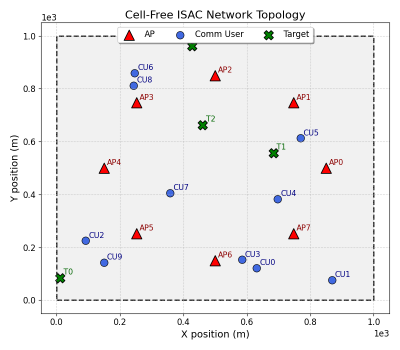
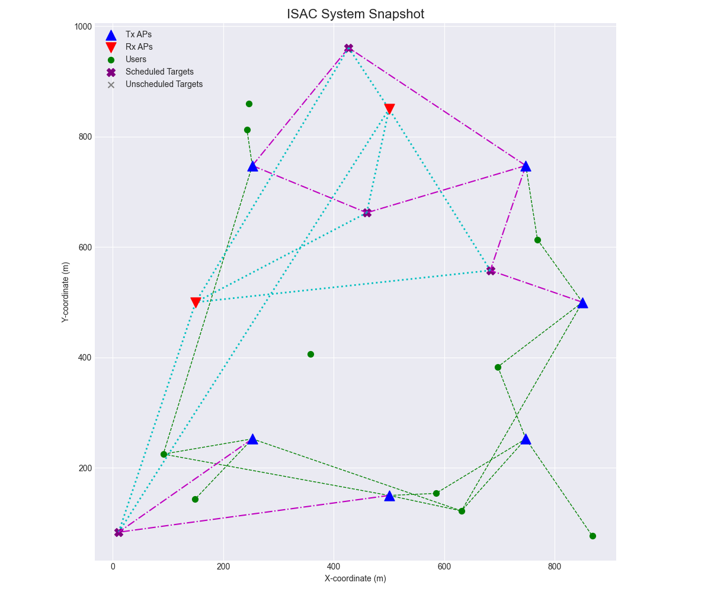

# ASSENT: Learning-Based Association Optimization for Distributed Cell-Free ISAC

This repository contains the official implementation of **ASSENT (ASSociation and ENTity selection)** — a learning-based framework for efficient association optimization in **distributed cell-free Integrated Sensing and Communication (ISAC)** systems.  
The framework is developed as part of the research paper:

> **"ASSENT: Learning-Based Association Optimization for Distributed Cell-Free ISAC"**  
> *Mehdi Zafari and A. Lee Swindlehurst*  
> Submitted to **IEEE International Conference on Communications (ICC) 2026**

---

## Overview

ASSENT addresses the **association problem** in distributed cell-free ISAC networks, where a central server determines:
- Which **access points (APs)** serve which **users and sensing targets**,  
- Each AP’s **operating mode** (transmit or receive),  
- And the scheduling of sensing entities —  
all under **fronthaul capacity, RF-chain, and interference constraints**.

The system first formulates the problem as a **Mixed-Integer Linear Program (MILP)** to obtain optimal associations. These optimal solutions are then used to **supervise a graph neural network (GNN)** that learns to predict association decisions efficiently for new environments.

---

## Repository Structure

```
distributed-cellfree-isac/
├── src/
│   ├── assent/                 # ASSENT code
│   │       ├── checkpoints     # Model parameters saved for different runs
│   │       └── figures/        # Figures for learning evaluation
│   ├── utils/                  # Utility functions and simulation classes
│   ├── optimization/           # MILP formulation and dataset generation
│   │       ├── exp1_baseline/  # Baseline MILP solution
│   │       ├── exp1_pareto/    # Pareto evaluation for MILP solutions
│   │       └── exp2_data_gen/  # MILP-based dataset generation
│   ├── learning_v1/            # GNN-based learning framework (v1)
│   ├── learning_v2/            # GNN-based learning framework (v2)
│   ├── learning_v3/            # GNN-based learning framework (v3)
│   └── learning_v4/            # GNN-based learning framework (v4) --> Current version
│           ├── cache_graphs/   # Cached graphs (precomputed)
│           ├── checkpoints/    # Model parameters saved for different runs
│           └── figures/        # Figures generated for learning evaluation
├── notebooks/                  # Jupyter notebooks for analysis and visualization
├── LICENSE                     # License file
├── requirements.txt            # Python dependencies
└── README.md                   # Repository overview
```

---

## Optimization Module

The MILP problem is implemented in Python using **Gurobi**.  
It optimizes a **weighted sum objective** of normalized communication and sensing utilities, with a tunable trade-off parameter `α`.

Key optimization outputs include:
- `τ` — AP mode selection (TX/RX)
- `x` — AP-user association
- `s` — target scheduling
- `y_tx`, `y_rx` — AP-target transmit/receive associations

The MILP generates optimal solutions used as training data for the learning framework.  
All optimization scripts and dataset generation tools are located in:

src/optimization/

---

## Learning Framework

The GNN-based learning framework is implemented in:

src/learning_v4/

### Features:
- **Heterogeneous Graph Representation** of the ISAC network  
  (APs, Users, and Targets as node types)
- **Multiple Message-Passing Architectures**:
  - `NNConv`
  - `GATv2Conv`
  - `TransformerConv`
- **Learnable Task Uncertainty** for multi-task loss balancing
- **Penalized Loss Function** with RF-chain and coupling regularization
- **Comprehensive Evaluation** using F1, Precision, Recall, and Brier score metrics

---

## Quickstart

### Setup
Clone the repository and install dependencies:

```bash
git clone https://github.com/LS-Wireless/ASSENT-CellFree-ISAC.git
cd ASSENT-CellFree-ISAC
pip install -r requirements.txt
```

### Import Utilities
Make sure to import the necessary utilities from the `utils` module:
```bash
import src.utils.visualization_utils as viz
import src.utils.optimization_utils as opt
import src.utils.network_utils as net
```

### Running Simulations
Below are simple examples of how to write scripts to generate network layout, run the MILP optimization, and visualize the results.

```bash
netparams = net.NetworkParams(N_ap=8, M_a=16, N_RF=4, N_cu=10, N_tg=4)
network = net.NetworkEnvironment(netparams)
network.generate_topology()
network.plot_topology()
```

<p align="center">
  
</p>

```bash
G_comm, S_comm = network.generate_commLink_features()
G_sens = network.generate_sensLink_features()

optparams = opt.ProblemParams(G_comm=G_comm_norm, G_sens=G_sens_norm, S_mat=S_comm, alpha=0.5)
optparams.change(lambda_cu=1.0, lambda_tg=1.0)
solution = opt.solve_problem(optparams)
```
```bash
viz.print_solution_summary(solution)
# System Snapshot
viz.plot_system_snapshot(ap_pos=network.ap_positions, user_pos=network.user_positions, target_pos=network.target_positions, sol=solution)
```

<p align="center">
  
</p>

---

## Citation

If you use this repository in your research, please cite:

### Paper
```bibtex
@inproceedings{zafari2026assent,
  title     = {ASSENT: Learning-Based Association Optimization for Distributed Cell-Free ISAC},
  author    = {Zafari, Mehdi and Swindlehurst, A. Lee},
  booktitle = {IEEE International Conference on Communications (ICC)},
  year      = {2026},
  note      = {Submitted}
}
```

### Code/Repository
```bibtex
@misc{zafari2025assent,
  title        = {ASSENT-CellFree-ISAC: Simulation Framework},
  author       = {Zafari, Mehdi},
  year         = {2025},
  howpublished = {GitHub repository},
  url          = {https://github.com/LS-Wireless/ASSENT-CellFree-ISAC},
  note         = {Version 1.0.0}
}
```
---

### Contact

For questions or collaborations, please contact:\
🌐 https://mehdizd97.github.io/


**Note:** This repository and associated algorithms are part of ongoing research. Final results and additional updates will be provided upon publication acceptance.

---

© 2025 Mehdi Zafari. All rights reserved.
